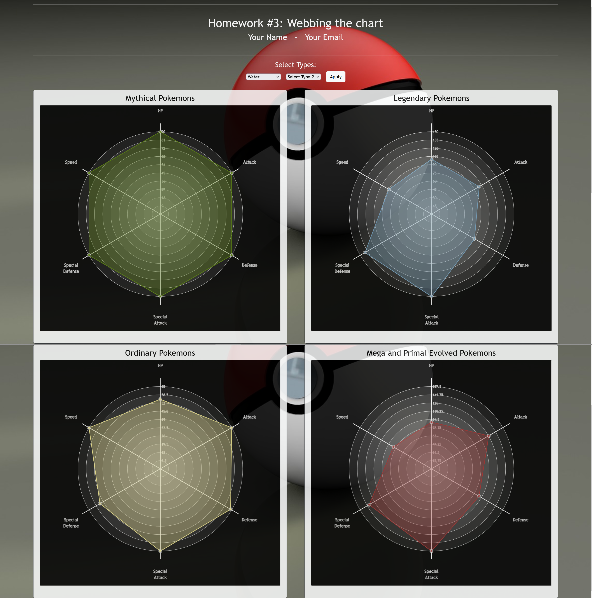

# Homework #3: Webbing the chart

The purpose of this homework is to teach you some building blocks and functionalities contained in D3.js:
By the end of this assignment you should be able to:

- Loading a dataset.
- Performing DOM selection.
- Filtering data attributes.
- Dynamically update visualized attributes.
- Using the D3 domain, range, and scale functions.
- Plot values in a spider chart along various axes.
- Add a tooltip.
- How to create another visualization within a tooltip based on user interactions.
- Usage of mouse-event interactions.

The screenshots below shows an example of what your finished interface will look like.

## Overview

The starter code for this assignment shows four panels on the `index.html` page. 
The top panel contains two `select` html elements and a `submit` button. 
The user can select pokemon types(type-1 and type-2) from the list and then click the button. 
This should create spider charts in the four panels present. 
The spider chart will visualize the median of values from the statistics of the selected pokemons based on their type (i.e., HP, Attack, Defense, Special Attack, Special Defense and Speed are the attributes which are represented as the axes in the chart).
Clicking a area under the spider chart will show a tooltip where it displays the count of the selected pokemons in every region in a bar chart. 

## Data Description

This assignment uses a csv file in the main branch: `Pokemon_Database.csv`. 
This file consists of 905 different pokemons which are present across 8 generations(from Kanto to Galar and Hisui), with the game statistics of each pokemon being recorded.
Attributes like HP, Attack, Defense, Special Attack, Special Defense and Speed are present in this dataset along with class labels like Generation, Type1, Type2, Category, Mega_Evolution_Flag and Region_Forme.

## To complete the assignment

- Clone this code template to your local machine.
- Start a local server and open the `index.html` page.
- Modify the given code according to the instructions below to achieve the requested interface.
- Commit and push the code back to this repository to submit it.

## Step 0: Starting code

When you first run the page, you should see the empty interface. Add your name and email to the top. It's up to you if you want to write your JavaScript code in a separate JS file, or in the main `index.html` file.

## Step 1: Creating select list
Create a `select` dropdown element in `index.html` inside the `div` element with a class `col-3`, and add all the 18 types from the dataset as options for the dropdown.
Then, add code so that, when the type in the `select` is changed, the drawSpiderChart() function in `main.js` will be called.

> 🔍 **Hint:** There's multiple ways to do this! For example, you could add an `onchange` event, or create an event listener using Javascript. 

## Step 2: Performing Data Wrangling
In `main.js`, the `Pokemon_Database.csv` file are loaded. Once the data is loaded, store it in one or more global variables so that when the type changes we don't need to load the dataset again.

Since D3 doesn't have any information about the attribute types of the new files, it interprets every data value as a string. To use the quantatitive columns as such, you'll need to do some data wrangling to convert each row of the data to the correct numeric format. 

For the six attributes, change the data type from string to numeric. D3's data loading functions (e.g. d3.csv) have a provision for that, which is documented [here](https://github.com/d3/d3-fetch/blob/master/README.md). You can also do the converting after you have loaded the data.

## Step 3: Displaying a Spider chart
When the user clicks on the `Apply` button, you should display a spider chart with six axes that show the distrubution of statistics of pokemons of a particular type selected from the `select` element (i.e., the median values of HP, Attack, Defense, Speed, Special Attack and Special Defense of all the pokemons under selected type for ordinary, mythical, mega/primal evolved and legendary categories from the dataset).
 
- You'll want to first read the stored dataset and filter the dataset according to the type of the pokemon selected from the list and store it in a set of one or more data structures. Every time the apply button is pressed, you'll need to recreate these variables with values of the given dataset using the selected filter.
- Your spider charts should be centered inside the respective SVG's of respective category division elements. Make sure the spider chart does not go outside of the `svg`'s bounds.
- Choose a categorical d3 color scale for this chart by picking a color scale from [https://github.com/d3/d3-scale-chromatic](https://github.com/d3/d3-scale-chromatic). For my screenshots, I'm using the `d3.schemeAccent` scale, but you can choose any categorical scale you like. Represent each category of pokemon with a color from the scale of your choice.
- Create circular bands to indicate the scale along the sequence of axes as shown in the above figure.

| 🔍 **Hint:** Here's two examples of making spider charts: [http://bl.ocks.org/nbremer/21746a9668ffdf6d8242](http://bl.ocks.org/nbremer/21746a9668ffdf6d8242), [http://bl.ocks.org/nbremer/6506614](http://bl.ocks.org/nbremer/6506614). Note that the both the chart implementation use an older version of D3, but the syntax is similar. |

## Step 4: Adding a tooltip for Spider chart
- When the user mouses over the points plotted in the axes or under the area of the spider chart, then create a `tooltip to display the value of the the trait of the corresponding axes` as shown in the figure. Upon hovering the area, emphasize the area by increasing its opacity from 0.4 to 0.7. While upon hovering the data point, emphasize the point by increasing stroke width from 1 to 5.

- When the user clicks on the area of the spider chart, then create a `tooltip that displays the count of the selected pokemons in every region in a bar chart` as illustrated in the next step.

| 🔍 **Hint:** When you mouse over a point or the area, you want to select the currently hovered element. Inside your `mouseover`/`mousemove`/`mouseout`/`click`/`dblclick` functions, `this` will return a reference to the point element or area element in the DOM. You might also consider calling these functions like so: `.on('mouseover', function(d, i) { ...})`. Use the Dev Tools to see what the `d` and `i` objects are, and what properties they contain, as a way to figure out how to reference the data item that is currently part of the event.|

 

## Step 5: Displaying a linked bar chart

When the user clicks on the area enclosed by the spider chart, draw a bar chart in the tooltip. The bar chart should be centered in the tooltip (with a reasonable margin, similar to the screenshot below), and show the count of the selected pokemons in every region.

- Compute the number of pokemons of required type and category across all the regions and store it in a data structure.
- Consider the region in the X-axis using `d3.scaleBand()` and the frequency of pokemons in the Y-axis using `d3.scaleLinear()`.
- The bars in the bar chart should be the same color as the area that was clicked on in the spider chart.
 
In my example below, the area in the spider chart is blue, so clicking on it will load a bar chart in the tooltip where the bars have same color(blue).
Clicking another area will change the color of the bars. It's also okay to give a bit of padding between the bars, like what I show in the screenshots (though this is optional). 
However, you should give the bars a 2-pixel thick border.
